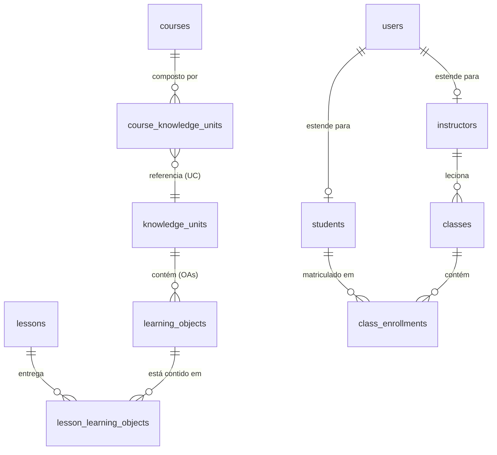

# Especificação Completa do Sistema - Sagacitas E-Learning

Este documento consolida a especificação técnica e funcional completa da plataforma **Sagacitas E-Learning** na revisão atual. A plataforma é uma solução SaaS de educação corporativa focada em gestão de negócios gastronômicos, integrando simulações práticas (DRE), inteligência instrucional (EdTech Expert) e gestão de cursos e turmas.

---

## 1. Arquitetura do Sistema e Estratégia SaaS Multi-Tenant

A plataforma adota um modelo híbrido para atender clientes de diferentes portes, suportando alta escalabilidade, isolamento de dados e faturamento baseado no consumo (Usage-Based Billing).

### 1.1. Camada de Autenticação e Proxy
- **Firebase Auth**: Responsável pela autenticação primária de e-mail/senha e provedores externos (OAuth 2.0).
- **Supabase JWT & API Keys**: Para conexões com o banco de dados Supabase e integrações Machine-to-Machine (M2M) via API Keys (`sk_live_...`).
- **Token Engine & Rate Limiter**: Middleware de API que valida permissões, aplica rate-limiting via Redis e envia logs de faturamento em tempo real.

### 1.2. Estratégia de Isolamento de Dados
- **Standard (Shared Database com RLS)**: Todos os tenants compartilham a mesma instância do banco de dados no Supabase. O isolamento é forçado via **Row Level Security (RLS)** usando a coluna `tenant_id` em todas as tabelas transacionais.
- **Enterprise (Siloed Database)**: Clientes de grande porte possuem schemas ou instâncias de banco de dados PostgreSQL totalmente dedicadas. O roteamento de conexão é gerenciado dinamicamente pelo API Gateway.

---

## 2. Fluxo de Autenticação e Perfis de Usuários

O sistema implementa uma sincronização de ciclo de vida entre o Firebase Auth (provedor de identidade) e as tabelas relacionais do Supabase / Firestore.

### 2.1. Classificação de Perfis (Roles)
- **Administrador (Admin Master / Gestor)**: Acesso completo às ferramentas de gestão, faturamento, auditoria de segurança e compositor de cursos.
- **Instrutor**: Visualização e gestão da Carteira de Instrutor, acompanhamento de progresso de alunos de suas turmas.
- **Aluno**: Acesso ao painel do aluno, simuladores (DRE), player de aulas e chat com Tutor de IA.
- **Visitante**: Perfil padrão para novos usuários cadastrados no sistema. Fica em estado pendente até que um Administrador aprove e o associe a um perfil específico de Aluno ou Instrutor.

### 2.2. Sincronização Automática de Dados
Quando um usuário faz login ou se cadastra pela primeira vez:
1. Um registro correspondente é criado/sincronizado no Firestore (`users/{uid}`).
2. Usuários sementes (ex: `admin.master@sagacitas.com.br`) são promovidos automaticamente para **Administrador** com permissões completas de UI e relatórios.
3. Se o e-mail não estiver na lista de administradores pré-definidos, o usuário é cadastrado como **Visitante** com permissões nulas.
4. Triggers no PostgreSQL atualizam as tabelas filhas `students` ou `instructors` de acordo com a mudança do papel (`role`) do usuário na tabela central `users`.

---

## 3. Estrutura do Banco de Dados (Supabase/PostgreSQL)

O esquema relacional é composto por 13 tabelas integradas:

### 3.1. Dicionário de Tabelas Principais

#### Tabela `users`
Armazena a entidade central de usuários autenticados via Firebase Auth.
- `id` (TEXT, PK): UID gerado pelo Firebase Auth.
- `name` (TEXT): Nome completo do usuário.
- `email` (TEXT, UNIQUE): E-mail do usuário.
- `avatar` (TEXT, Nullable): URL da imagem de perfil.
- `provider` (TEXT, Nullable): Provedor de login (ex: "Password", "Google").
- `role` (TEXT): Papel no sistema ("Visitante", "Aluno", "Instrutor", "Administrador"). Default: "Visitante". As permissões do perfil são puxadas da coleção `roles`.
- `permissionsHash` (TEXT, Nullable): Hash string dinâmico mapeando as permissões (CRUD) de leitura/escrita do usuário, gerado via modelo RBAC.
- `status` (TEXT): Estado da conta ("active", "blocked"). Default: "active".
- `company_name` (TEXT, Nullable): Nome da empresa contratante.
- `enrollment_type` (TEXT, Nullable): Tipo de matrícula (individual/corporativa).
- `authenticated_at` (TIMESTAMPTZ, Nullable): Timestamp do último login.
- `created_at` / `updated_at` (TIMESTAMPTZ): Registro de auditoria temporal.

#### Tabela `students`
Armazena dados específicos do perfil de alunos.
- `id` (TEXT, PK, FK -> `users.id` ON DELETE CASCADE): UID do aluno.
- `first_name` / `last_name` (TEXT, Nullable).
- `email` (TEXT, UNIQUE).
- `avatar_url` (TEXT, Nullable).
- `enrollment_status` (TEXT): Status da matrícula ("active", "blocked").
- `company_id` (UUID, Nullable, FK -> `companies.id`).
- `enrollment_type` (TEXT). Default: "individual".

#### Tabela `instructors`
Armazena dados específicos do perfil de instrutores.
- `id` (TEXT, PK, FK -> `users.id` ON DELETE CASCADE): UID do instrutor.
- `first_name` / `last_name` (TEXT, Nullable).
- `email` (TEXT, UNIQUE).
- `avatar_url` (TEXT, Nullable).

#### Tabela `courses`
Catálogo de cursos da plataforma.
- `id` (UUID, PK): ID único autogerado.
- `title` (TEXT): Título do curso.
- `level` (TEXT, Nullable): Nível de dificuldade.
- `description` (TEXT, Nullable): Descrição detalhada.
- `duration_minutes` (INTEGER, Nullable): Duração total estimada.
- `status` (TEXT): Estado do curso ("active", "blocked", "cancelled").
- `category_id` (UUID, FK -> `course_categories.id`, Nullable).
- `course_code` (VARCHAR(10), UNIQUE, Nullable): Código de identificação do curso.
- `modules` (JSONB, Nullable): Árvore curricular contendo módulos e aulas dinâmicas cadastradas pelo gestor.
- `presentation` (JSONB, Nullable): Arquivo do deck de slides de autoria salvos no editor de slides.
- `category` (TEXT, Nullable): Nome direto da categoria para visualização simples no catálogo.

#### Tabela `course_knowledge_units`
Tabela intermediária que mapeia as Unidades de Conhecimento (UCs) a um determinado Curso.
- `id` (UUID, PK): ID autogerado.
- `course_id` (UUID, FK -> `courses.id` ON DELETE CASCADE).
- `uc_id` (UUID, FK -> `knowledge_units.id` ON DELETE CASCADE): Referência rigorosa à Unidade de Conhecimento (UC).
- `sequence_order` (INTEGER): Ordem de exibição e progressão da UC no curso.
- *Restrição*: `UNIQUE(course_id, uc_id)`.

#### Tabela `learning_objects` (OAs)
Unidades atômicas de aprendizado modular contidas dentro de uma UC.
- `id` (UUID, PK): ID autogerado.
- `knowledge_unit_id` (UUID, FK -> `knowledge_units.id` ON DELETE CASCADE).
- `object_type` (TEXT): Formato do objeto (`video`, `reading`, `quiz`, `dre_simulation`).
- `bloom_level` (INTEGER): Nível de complexidade da taxonomia de Bloom (1 a 6).
- `content_payload` (JSONB): Mídia ou metadados da instrução em si.

#### Tabela `lessons`
Atua estritamente como um contêiner operacional (encontro temporal ou pacote de entrega).
- `id` (UUID, PK): ID autogerado.
- `title` (TEXT): Título da aula.
- Não armazena mídias diretamente.

#### Tabela `lesson_learning_objects`
Tabela $N \times N$ que relaciona quais OAs (Objetos de Aprendizagem) são entregues em qual contêiner de Aula.
- `id` (UUID, PK).
- `lesson_id` (UUID, FK -> `lessons.id` ON DELETE CASCADE).
- `learning_object_id` (UUID, FK -> `learning_objects.id` ON DELETE CASCADE).
- `sequence_order` (INTEGER): Ordem de execução do OA dentro daquela aula.

---

## 4. Módulos Funcionais e UIs

### 4.1. Simulador de DRE Operacional
- Simulador interativo que ensina Engenharia de Cardápio e Gestão de Custos para restaurantes.
- Exibe em tempo real o impacto de ajustes no CMV (Custo de Mercadoria Vendida), custos de pessoal, aluguel, taxas de entrega e impostos no EBITDA e lucro líquido final.
- Apresenta validações visuais baseadas nos padrões de formatação da plataforma (canto `rounded-md`, sombras `shadow-2xs` e cores semânticas para lucratividade/prejuízo).

### 4.2. Central de Gestão de Cursos (`ManagerToolsView`)
Dashboard administrativo com abas para gerenciar alunos, turmas, certificados e o catálogo de cursos.
- **Botão "Cadastrar UCs"**: Redireciona o gestor para a tela do Compositor de UCs do curso selecionado.
- **Botão "Editar Aulas"**: Abre o modal clássico de edição direta de slides.

### 4.3. Compositor de UCs (`CourseUCComposerView`)
Interface avançada de autoria e organização curricular estruturada em:
1. **Cabeçalho**: Exibe nome do curso, categoria e estatísticas consolidadas (total de UCs adicionadas, carga horária acumulada e contagem total de elementos didáticos).
2. **Biblioteca de UCs (Painel Direito)**: Lista rolável de Unidades de Conhecimento cadastradas no sistema, com suporte a busca rápida.
3. **Grade Curricular Dinâmica (Central)**: Painel interativo para estruturação de **Módulos** e **Aulas**:
   - Criação, edição (título e foco didático) e exclusão de Módulos sob demanda.
   - Criação, edição (título e objetivo de aprendizagem) e exclusão de Aulas dentro de cada módulo.
   - **Alocação via Drag and Drop**: O gestor pode arrastar UCs da biblioteca e soltá-las diretamente dentro de qualquer Aula da grade curricular. A associação é mapeada e persistida no banco por meio do identificador sequencial `aula_group`.

### 4.4. Editor e Player de Slides (`CourseSlideEditorModal`)
Editor WYSIWYG que permite aos gestores criarem apresentações multimídia interativas vinculadas às aulas do curso:
- **Canvas Central**: Renderiza a tela de pintura e posicionamento dos slides em proporção (16:9).
- **Padronização de Componentes**: A barra de ferramentas lateral importa e cria elementos seguindo estritamente a tipagem unificada de UCs (`text`, `image`, `video`, `audio`, `question` e `simulation`).
- **Níveis de Camada (Z-Index)**: Suporte nativo para configuração de camadas (`zIndex`) de cada elemento no PropertyInspector para evitar sobreposição indesejada.
- **Persistência & Roteamento Dinâmico**: A apresentação de slides completa é salva na coluna `presentation` do curso. No player de aula do aluno (`LessonPlayerView`), os slides são carregados e filtrados em tempo real de acordo com a numeração sequencial (`aula_group`) da aula selecionada.

### 4.5. EdTech Expert Module
Área avançada de engenharia pedagógica:
- **Cadastro de UCs**: Criação de novas Unidades de Conhecimento vinculando tópicos à Taxonomia de Bloom e estruturando o template AST de componentes.
- **Diagnóstico DNT (Necessidades de Treinamento)**: Algoritmo que aplica testes e calibra a régua de corte e isenção de aulas com base nas competências exigidas para o cargo do colaborador.
- **Gestão de Acesso**: Interface de liberação rápida de novos usuários cadastrados no Firebase, associando-os a perfis Supabase.

---

## 5. Diretrizes de Design de Interface (UI Guidelines)

O sistema segue as regras de estilização consolidadas no arquivo [padrao_formatacao_ui.md](file:///mnt/46F84CA3F84C935B/SAGACITAS_SaaS/Projeto%20E-Learning/Sagacitas-E-Learning/specs/padrao_formatacao_ui.md):
- **Bordas e Cantos**: Arredondamento estritamente corporativo (`rounded-md`).
- **Sombras**: Utilização de `shadow-2xs` para cards secundários e `shadow-lg` para modais com fundo desfocado (`backdrop-blur-sm`).
- **Feedback Visual**:
  - `#1890ff` (Azul Sagacitas) para ações principais.
  - `emerald-500` (Verde) para conquistas, acertos e lucro DRE.
  - `amber-500` (Laranja) para alertas e CMV no limite.
  - `red-500` (Vermelho) para prejuízo operacional e erros de resposta.
