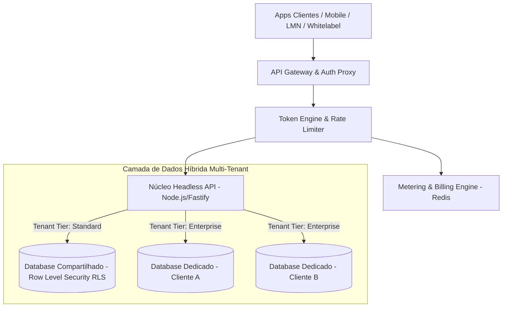
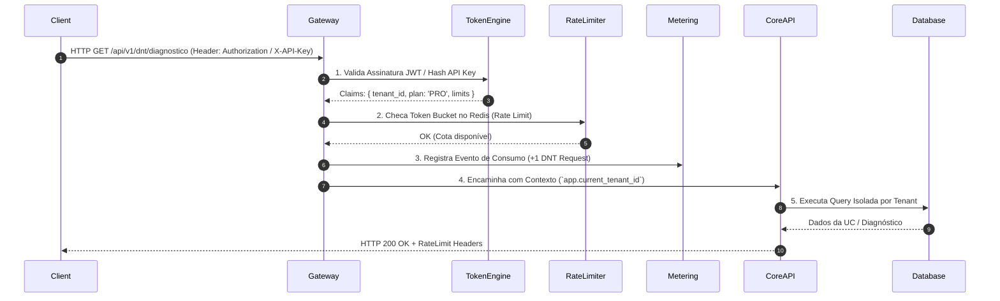
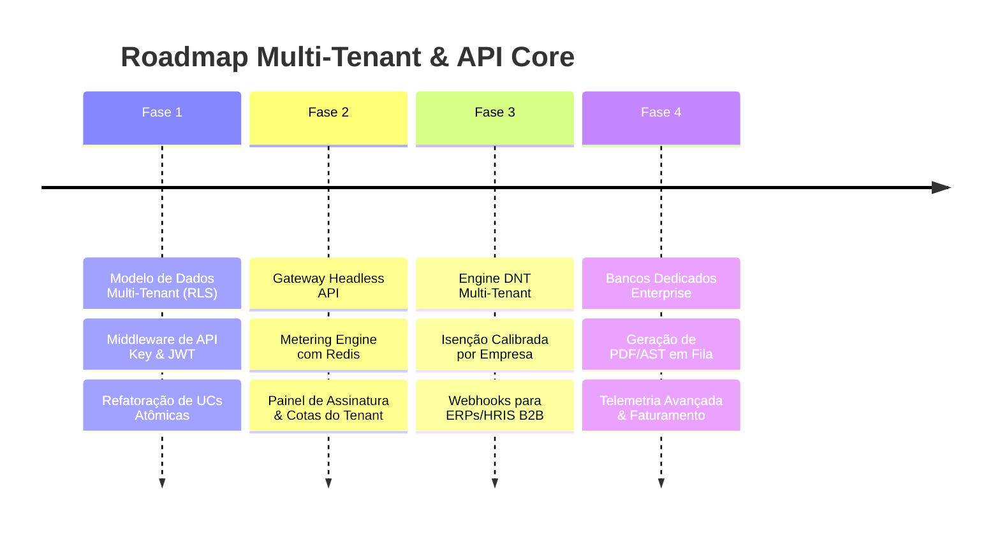

# Arquitetura Tecnológica Multi-Tenant & API Core: Plataforma EdTech Expert (Sagacitas E-Learning)

Este documento atualiza e expande a especificação de arquitetura para suportar uma solução **SaaS Multi-Tenant de Alta Disponibilidade**, **Núcleo Headless via API REST/gRPC com Autenticação por Token (JWT/API Keys)** e **Motor de Precificação & Telemetria por Consumo (Metering & Rate Limiting)**.

---

## 1. Arquitetura Multi-Tenant & Isolamento de Dados

Para atender desde clientes corporativos de pequeno porte (SaaS compartilhado) até grandes empresas com requisitos rígidos de conformidade (LGPD/GDPR e bancos dedicados), a plataforma adota um modelo **Multi-Tenant Híbrido**:



### 1.1. Estratégias de Isolamento de Dados

1. **SaaS Pooled (Shared Database com RLS):**
   - Todos os dados residem na mesma instância PostgreSQL/Supabase.
   - Todas as tabelas contêm a coluna `tenant_id UUID NOT NULL`.
   - Policiamento via **Row Level Security (RLS)** nativo do PostgreSQL:
     ```sql
     CREATE POLICY tenant_isolation_policy ON unidades_conhecimento
     USING (tenant_id = current_setting('app.current_tenant_id')::uuid);
     ```
2. **Enterprise Siloed (Database / Schema Independente):**
   - Clientes Enterprise possuem instâncias de PostgreSQL dedicadas ou *Schemas* isolados (`tenant_acme_corp.unidades_conhecimento`).
   - O API Gateway faz o roteamento dinâmico da *Connection Pool* através do `tenant_id` extraído do Token JWT ou API Key.

---

## 2. Autenticação, Autorização e API Core (Núcleo Decoplado)

### 2.1. Formatos de Tokens & Acesso
- **Bearer JWT (Sessões de Alunos e Gestores):** Emitidos no login via OAuth2/OIDC. Carregam `user_id`, `tenant_id`, `role` e `scopes`.
- **API Keys (`sk_live_...`):** Para integrações B2B M2M (Machine-to-Machine) via ERPs/HRIS (SAP SuccessFactors, Workday, TOTVS).

### 2.2. Pipeline de Validação de Requisição (Middleware Stack)



---

## 3. Modelo de Precificação & Metering por Consumo (Usage-Based Billing)

O sistema valida o nível de acesso e tarifação com base em métricas de uso acumulado por Tenant em tempo real (estilo Stripe Metered Billing / AWS Pay-as-you-go).

### 3.1. Métricas de Faturamento & Cotas por Plano

| Métrica de Consumo | Unidade de Medida | Validação / Rate Limit |
| :--- | :--- | :--- |
| **Active Learners (MAU)** | Alunos Únicos Ativos/Mês | Hard Limit ou Cobrança Adicional por Bloco de 100 usuários |
| **Execuções Diagnósticas DNT** | Testes DNT Rodados | Tarifado por execução do algoritmo calibrado de Bloom |
| **Geração de Materiais Didáticos** | Compilação de PDFs/ASTs | Quota de processamento em background (ex: 500 PDFs/mês) |
| **Armazenamento de Mídia** | Gigabytes / Mês | Medição de vídeos, áudios e imagens carregadas |
| **Requisições à API Core** | Hits/Minuto (RPS) | Rate Limiting via Redis Sliding Window (ex: 100 req/s) |

### 3.2. Estrutura do Banco para Gestão Multi-Tenant & Billing

```sql
-- Tabela de Tenants (Organizações Clientes)
CREATE TABLE tenants (
  id UUID PRIMARY KEY DEFAULT gen_random_uuid(),
  slug VARCHAR(100) UNIQUE NOT NULL,
  nome_fantasia VARCHAR(255) NOT NULL,
  cnpj VARCHAR(20),
  plano_assinatura VARCHAR(50) DEFAULT 'STANDARD', -- 'FREE', 'STANDARD', 'PRO', 'ENTERPRISE'
  db_strategy VARCHAR(20) DEFAULT 'SHARED_RLS', -- 'SHARED_RLS', 'DEDICATED_DB'
  connection_string_secret_name VARCHAR(255), -- Para tenants enterprise
  status VARCHAR(20) DEFAULT 'ACTIVE',
  created_at TIMESTAMP WITH TIME ZONE DEFAULT NOW()
);

-- Tabela de API Keys dos Tenants
CREATE TABLE tenant_api_keys (
  id UUID PRIMARY KEY DEFAULT gen_random_uuid(),
  tenant_id UUID REFERENCES tenants(id) ON DELETE CASCADE,
  key_hash VARCHAR(255) UNIQUE NOT NULL,
  nome_identificador VARCHAR(100) NOT NULL,
  scopes JSONB NOT NULL, -- ["dnt:read", "dnt:write", "uc:read"]
  expires_at TIMESTAMP WITH TIME ZONE,
  revogada BOOLEAN DEFAULT FALSE,
  created_at TIMESTAMP WITH TIME ZONE DEFAULT NOW()
);

-- Tabela de Telemetria e Consumo (Usage Metering)
CREATE TABLE tenant_usage_logs (
  id BIGSERIAL PRIMARY KEY,
  tenant_id UUID REFERENCES tenants(id) ON DELETE CASCADE,
  metrica VARCHAR(50) NOT NULL, -- 'DNT_EXECUTION', 'API_CALL', 'PDF_GENERATED'
  quantidade INT DEFAULT 1,
  metadata JSONB,
  registrado_em TIMESTAMP WITH TIME ZONE DEFAULT NOW()
);

CREATE INDEX idx_usage_tenant_periodo ON tenant_usage_logs(tenant_id, metrica, registrado_em);
```

---

## 4. Reavaliação dos Artefatos de Engenharia Instrucional no Contexto Multi-Tenant

### 4.1. Unidades de Conhecimento (UCs) Globais vs. Customizadas do Tenant
- **UCs de Prateleira (Global Marketplace):** UCs padrão mantidas pela Sagacitas (ex: Segurança do Trabalho, DRE Financeira) possuem `tenant_id = NULL` e permissão de leitura para todos os assinantes.
- **UCs Customizadas (Tenant Proprietary):** UCs desenvolvidas sob medida por um cliente possuem `tenant_id` específico e isolamento absoluto de IP (Propriedade Intelectual).

### 4.2. Motor DNT com Regras de Isenção Configuráveis por Tenant
- Cada Tenant define sua própria **Régua de Corte para Isenção** (ex: Tenant A exige 80% no nível de Aplicação Complexa para isenção; Tenant B exige 90%).
- As regras são armazenadas na coluna `configuracao_calibracao` da tabela `diagnosticos_dnt` scoped por `tenant_id`.

---

## 5. Matriz de Riscos Multi-Tenant & Mitigações de Arquitetura

| Risco Técnico | Impacto | Solução de Engenharia |
| :--- | :---: | :--- |
| **1. Vazamento de Dados entre Tenants (Cross-Tenant Data Leak)** | 🔴 Crítico | **Enforcement Triplo de Tenant ID:** 1. Middleware API extrai e injeta o `tenant_id`. 2. PostgreSQL RLS bloqueia no nível do BD. 3. Testes automatizados de invasão multitenant no pipeline de CI/CD. |
| **2. Efeito "Vizinho Barulhento" (Noisy Neighbor Problem)** | 🔴 Alto | **Rate Limiting por Tenant no Redis:** Implementação do algoritmo *Token Bucket* isolado por Tenant ID. Requisições acima da cota recebem `HTTP 429 Too Many Requests`. |
| **3. Latência no Cálculo de Faturamento por Consumo em Larga Escala** | 🟡 Médio | **Escrita Assíncrona no Redis + Flush Periódico:** Log de consumo gravado em Redis em memória ($<1ms$) e sincronizado com a tabela PostgreSQL `tenant_usage_logs` a cada 5 minutos via Job Batch. |

---

## 6. Roadmap Técnico Atualizado para SaaS Multi-Tenant



---

## 7. Próximos Passos Recomendados

1. **Aprovação do Modelo Híbrido de Dados:** Validar a estratégia de `tenant_id` + RLS para os planos Standard e instâncias isoladas para Enterprise.
2. **Definição da Tabela de Tarifação:** Validar quais métricas de consumo (MAU, chamadas DNT, armazenamento) serão cobradas no plano.
